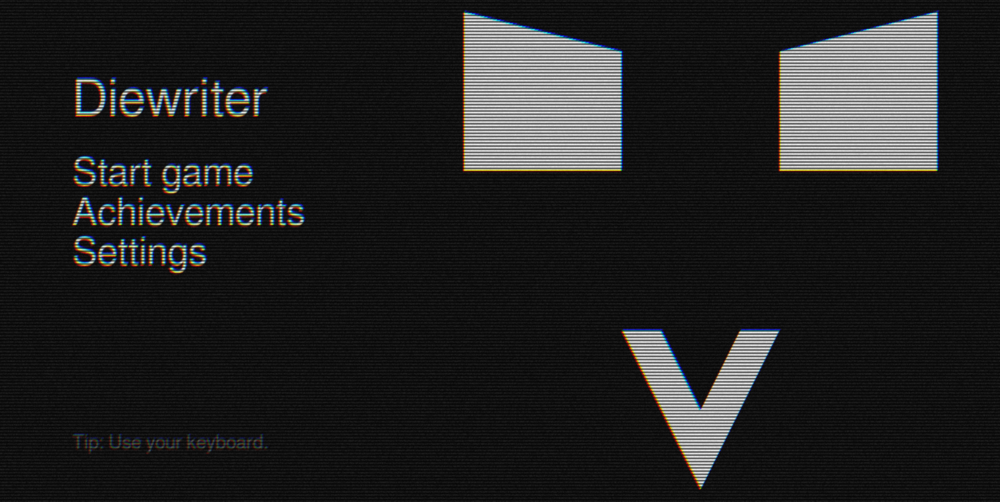
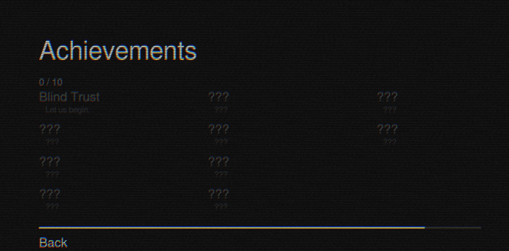
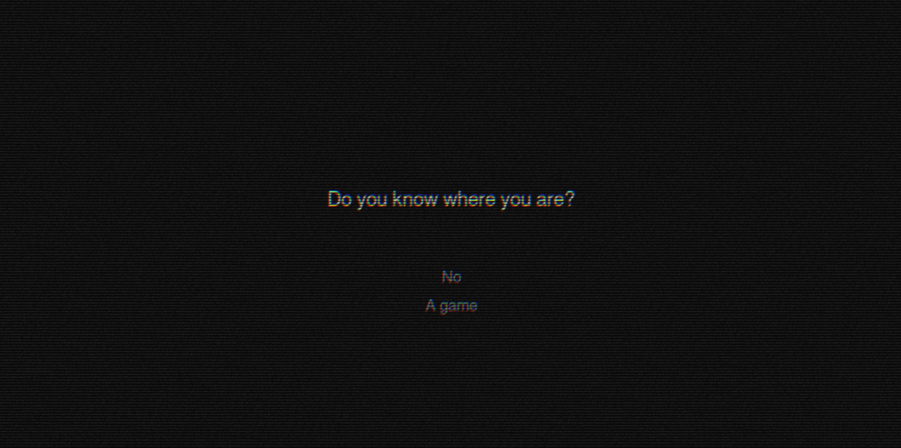
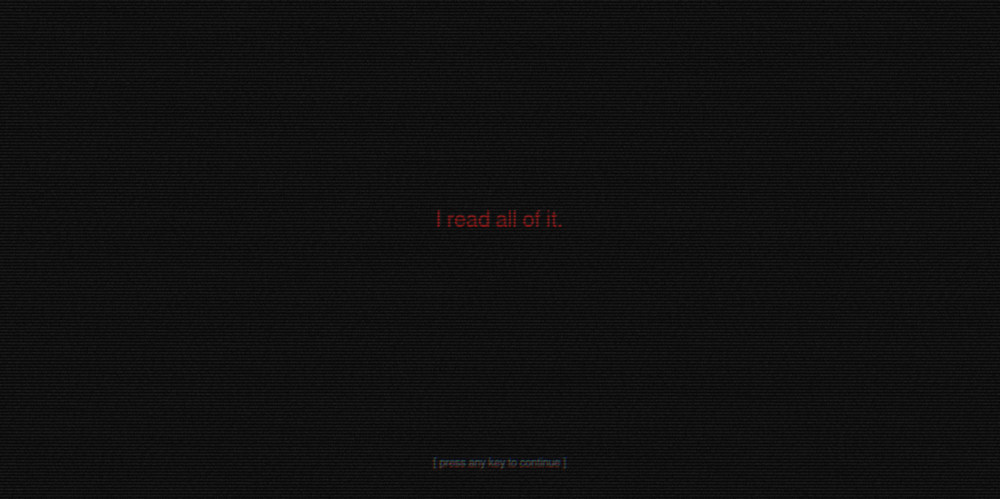

# Diewriter

A keyboard-driven interactive horror fiction game. Runs in the browser.

**[Play](https://jkopas0.github.io/diewriter/)**

## Controls

All navigation is done by typing — no mouse required.

| Input | Action |
|---|---|
| Type a menu item | Selects it when the full label matches |
| `Tab` | Autocompletes the current partial match |
| `Escape` | Cancel input / return to main menu |
| `←` / `→` | Scroll the achievements list |
| Any key | Advance dialogue |

## Settings

Accessible from the main menu.

- **Audio** — sound effects volume, background noise volume (e.g. type `sound effects 80%`)
- **Graphics** — film grain, chromatic aberration, scanlines (each toggleable)

## Running locally

No build step. Serve the `www/` directory with any static file server:

```sh
npx serve www
# or
python3 -m http.server --directory www
```

Then open `http://localhost:3000` (or whatever port the server reports).

## Tech

- Vanilla JS, no framework or bundler
- WebGL canvas (1280×640)
- Post-processing: chromatic aberration, film grain, scanlines
- Audio: Web Audio API via `<audio>` elements

## Directory structure

```
diewriter/
└── www/                        # Everything served to the browser
    ├── index.html
    ├── robots.txt
    ├── sitemap.xml
    └── static/
        ├── assets/
        │   └── sfx/            # OGG sound effects (keypress, text, achievement, white noise)
        ├── css/
        │   └── style.css
        ├── img/
        │   └── favicon.ico
        └── js/
            ├── bundle.js       # Concatenated build of all JS modules
            ├── main.js         # Entry point — game loop, input, audio, state
            ├── prefab.js       # Reusable composite GameObjects (e.g. Face)
            ├── includes/
            │   ├── gameObject.js   # WebGL primitives: Triangle, Quad, Text
            │   └── shader.js       # Post-processing shader and render target
            └── screens/
                ├── mainMenu.js
                ├── settingsMenu.js
                ├── gameScreen.js
                └── achievementMenu.js
```

## Technical explanation

### Two-pass WebGL rendering pipeline

Every frame goes through two distinct GPU passes rather than drawing directly to the screen. This allows the full scene to be treated as a texture and then distorted by post-processing effects in a second draw call.

**Pass 1 — scene → framebuffer.** The game loop binds an off-screen framebuffer backed by a plain RGBA texture and clears it. All screen logic (`mainMenu`, `gameScreen`, etc.) draws into this target using `GameObject` primitives.

**Pass 2 — post-processing → screen.** After all scene geometry is drawn, the framebuffer is unbound and `Shader.applyPostShader` runs a full-screen quad through a GLSL fragment shader that reads from that texture and outputs directly to the canvas. Three independent effects are composited in a single shader invocation:

- **Chromatic aberration** — the red and blue channels are sampled at UV offsets in opposite directions, simulating lens fringing.
- **Film grain** — per-pixel pseudo-random noise keyed on a time uniform so it changes every frame.
- **Scanlines** — a sine wave modulates brightness along the Y axis to produce CRT-style banding.

```js
// main.js — one frame
ctx.bindFramebuffer(ctx.FRAMEBUFFER, tgt.framebuffer); // pass 1: draw scene here
ctx.clear(ctx.COLOR_BUFFER_BIT);
screens[state.screen](canvas, ctx, input, prefabs, state);

ctx.bindFramebuffer(ctx.FRAMEBUFFER, null);            // pass 2: composite to screen
Shader.applyPostShader(ctx, postShader, tgt.texture, state.graphics, now, canvas.height);
```

The fragment shader for pass 2 applies all three effects in sequence:

```glsl
void main() {
  // chromatic aberration: R and B sampled at ±offset
  float r = texture2D(u_texture, v_uv + u_aberration).r;
  float g = texture2D(u_texture, v_uv).g;
  float b = texture2D(u_texture, v_uv - u_aberration).b;
  vec3 color = vec3(r, g, b);

  // film grain: time-seeded hash noise
  color += (rand(v_uv + u_grain_time) - 0.5) * u_grain_strength;

  // scanlines: sine wave along Y
  float band = sin(v_uv.y * u_scanline_count * 3.14159265) * 0.5 + 0.5;
  color *= 1.0 - u_scanline_strength * (1.0 - band);

  gl_FragColor = vec4(color, a);
}
```

Each effect is independently toggled from the settings menu by zeroing its corresponding uniform (`u_grain_strength`, `u_scanline_strength`, `u_aberration`) — the shader always runs, so toggling has no CPU cost.

## Screenshots




